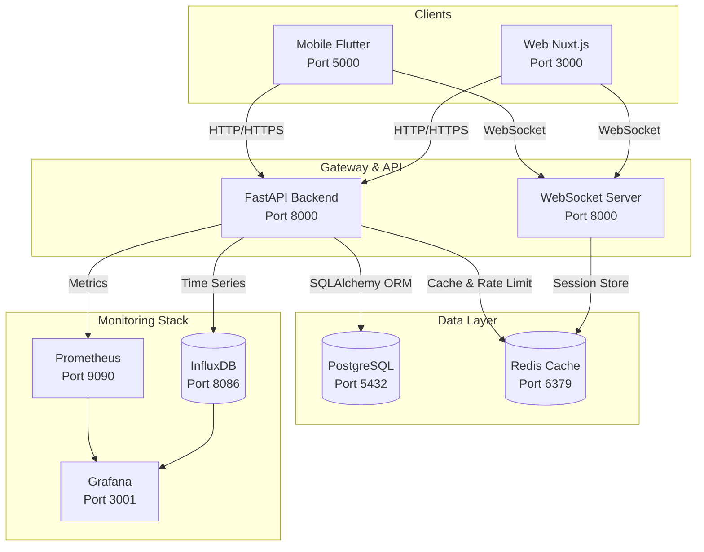
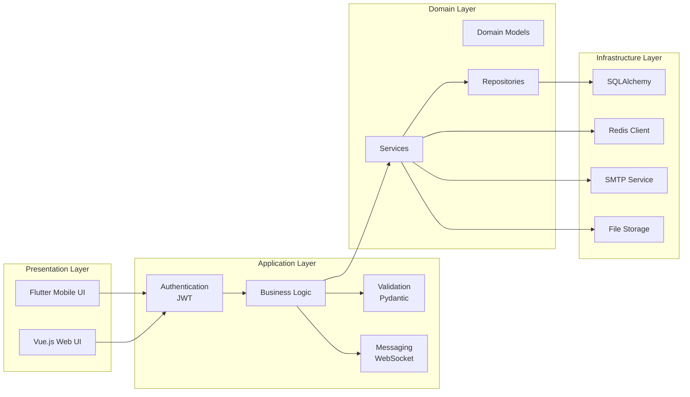
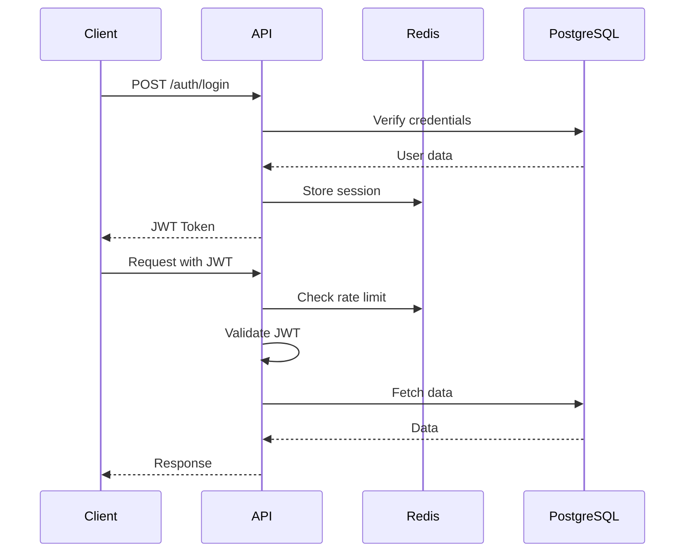
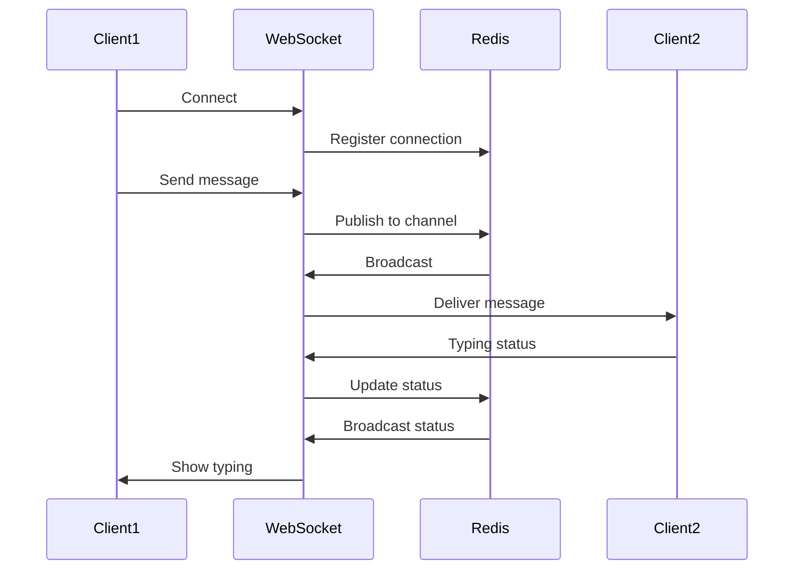
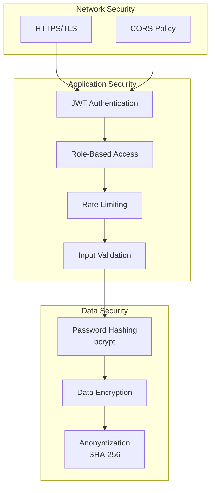
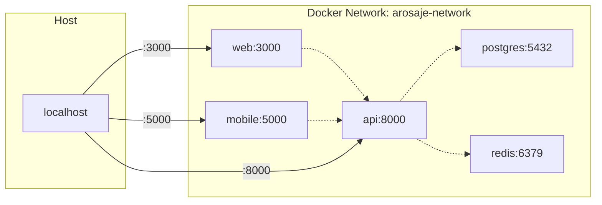
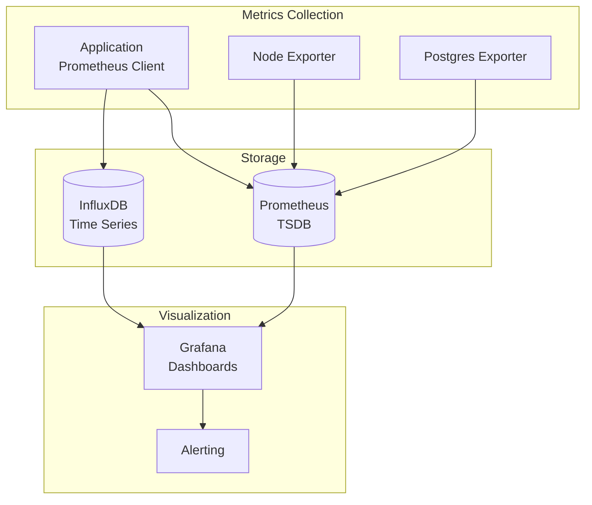

# Architecture de l'application A'rosa-je

## Vue d'ensemble de l'architecture



## Architecture en couches



## Flux de données

### 1. Authentification et autorisation



### 2. Messagerie temps réel



## Composants détaillés

### Backend API (FastAPI)

| Composant | Responsabilité | Technologies |
|-----------|---------------|--------------|
| **Routers** | Endpoints REST | FastAPI routers |
| **Services** | Logique métier | Python classes |
| **Models** | Entités domaine | SQLAlchemy ORM |
| **Schemas** | Validation | Pydantic |
| **Middleware** | Cross-cutting | CORS, Auth, Logging |
| **WebSocket** | Temps réel | WebSocket protocol |

### Base de données PostgreSQL

| Schema | Tables | Index | Contraintes |
|--------|--------|-------|-------------|
| **public** | users, plants, plant_cares | B-tree sur FK | UNIQUE, CHECK |
| **messaging** | conversations, messages | GIN pour recherche | CASCADE DELETE |
| **monitoring** | audit_logs, metrics | BRIN temporel | Partitioning |

### Cache Redis

| Usage | Structure | TTL | Pattern |
|-------|-----------|-----|---------|
| **Sessions** | Hash | 24h | session:{user_id} |
| **Rate Limiting** | String | 1min | rate:{ip}:{endpoint} |
| **WebSocket** | PubSub | - | channel:{conv_id} |
| **Cache** | String | 5min | cache:{key} |

## Sécurité

### Couches de sécurité



### Matrice des permissions

| Rôle | Plants | Gardes | Conseils | Admin | Messages |
|------|--------|--------|----------|-------|----------|
| **USER** | CRUD propres | CRUD | Lecture | ❌ | ✅ |
| **BOTANIST** | Lecture | Lecture | CRUD | ❌ | ✅ |
| **ADMIN** | CRUD tous | CRUD tous | Modération | ✅ | ✅ |

## Déploiement

### Architecture Docker

```yaml
Services:
  api:
    - Image: Python 3.11-slim
    - Volumes: ./api:/app, uploads
    - Ports: 8000
    - Depends: postgres, redis
    
  web:
    - Image: Node 18-alpine
    - Volumes: ./web:/app
    - Ports: 3000
    - Depends: api
    
  mobile:
    - Image: Flutter latest
    - Volumes: ./mobile:/app
    - Ports: 5000
    - Depends: api
    
  postgres:
    - Image: PostgreSQL 15
    - Volumes: pgdata
    - Ports: 5432
    
  redis:
    - Image: Redis 7-alpine
    - Volumes: redis-data
    - Ports: 6379
```

### Réseau Docker



## Monitoring et observabilité

### Stack de monitoring



### Métriques clés

| Métrique | Source | Seuil d'alerte | Dashboard |
|----------|--------|----------------|-----------|
| **API Latency** | FastAPI | > 500ms | Performance |
| **Error Rate** | Logs | > 1% | Health |
| **DB Connections** | PostgreSQL | > 80% pool | Database |
| **Cache Hit Rate** | Redis | < 70% | Cache |
| **WebSocket Connections** | API | > 1000 | Real-time |
| **Memory Usage** | Container | > 80% | Resources |

## Scalabilité

### Stratégies de mise à l'échelle

1. **Horizontal Scaling**
   - API: Multiple instances behind load balancer
   - WebSocket: Sticky sessions avec Redis PubSub
   - Database: Read replicas pour lectures

2. **Vertical Scaling**
   - PostgreSQL: Augmentation RAM pour cache
   - Redis: Plus de mémoire pour sessions

3. **Optimisations**
   - CDN pour assets statiques
   - Lazy loading des images
   - Pagination des listes
   - Indexation base de données
   - Query optimization

## Conformité RGPD

### Mesures techniques

- **Minimisation**: Collecte uniquement des données nécessaires
- **Pseudonymisation**: Hash SHA-256 pour exports
- **Chiffrement**: TLS pour transport, bcrypt pour passwords
- **Droit à l'oubli**: CASCADE DELETE sur suppression user
- **Portabilité**: Export JSON des données utilisateur
- **Audit**: Logs de tous les accès aux données sensibles
- **Rétention**: 30 jours pour messages, 1 an pour logs

## Points d'extension

### APIs externes intégrables

- **Météo**: Pour conseils d'arrosage automatiques
- **Reconnaissance d'images**: Identification automatique des espèces
- **Notifications Push**: Firebase Cloud Messaging
- **Paiement**: Pour fonctionnalités premium
- **Maps**: Géolocalisation des gardiens disponibles

### Modules futurs

- Marketplace de plantes
- Forum communautaire
- Système de gamification
- Application IoT pour capteurs
- Intelligence artificielle pour diagnostic