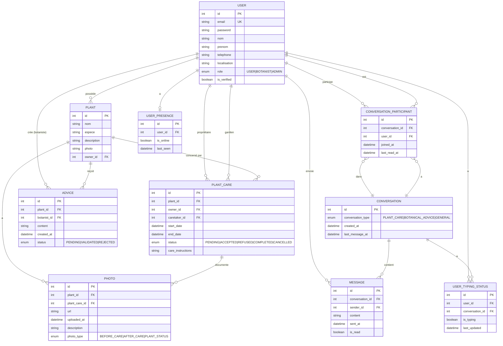

# Diagramme UML - Base de données A'rosa-je

## Vue d'ensemble



## Description des entités

### USER (Utilisateur)
- **Rôles** : USER (propriétaire/gardien), BOTANIST (conseils), ADMIN (gestion)
- **Vérification** : Les comptes doivent être validés par un admin
- **Relations** : Peut posséder des plantes, garder des plantes, donner des conseils (si botaniste)

### PLANT (Plante)
- **Propriétaire** : Chaque plante appartient à un utilisateur
- **Photos** : Stockage du chemin vers l'image principale
- **Métadonnées** : Nom, espèce, description pour identification

### PLANT_CARE (Garde de plante)
- **Relation tripartite** : Lie propriétaire, gardien et plante
- **Workflow** : États de PENDING à COMPLETED
- **Instructions** : Conseils spécifiques pour la garde

### PHOTO
- **Documentation** : Photos avant/après garde
- **Traçabilité** : Horodatage et type de photo
- **Association** : Liée à une plante ET/OU une garde

### ADVICE (Conseil)
- **Expertise** : Créé uniquement par des botanistes
- **Validation** : Système de modération
- **Contexte** : Lié à une plante spécifique

### MESSAGE & CONVERSATION
- **Messagerie temps réel** : WebSocket pour chat instantané
- **Types de conversation** : Garde, conseil botanique, général
- **Participants multiples** : Support des groupes
- **Statuts** : Typing, présence, lecture

## Optimisations PostgreSQL

### Index
```sql
CREATE INDEX idx_plant_owner ON plants(owner_id);
CREATE INDEX idx_plant_care_status ON plant_cares(status);
CREATE INDEX idx_message_conversation ON messages(conversation_id, sent_at DESC);
CREATE INDEX idx_advice_plant ON advices(plant_id);
CREATE INDEX idx_user_email ON users(email);
```

### Contraintes
```sql
ALTER TABLE plant_cares ADD CONSTRAINT check_dates 
  CHECK (end_date IS NULL OR end_date > start_date);

ALTER TABLE users ADD CONSTRAINT check_role 
  CHECK (role IN ('USER', 'BOTANIST', 'ADMIN'));
```

### Fonctionnalités PostgreSQL utilisées
- **JSONB** : Pour stocker des métadonnées flexibles
- **Full-text search** : Recherche dans les descriptions
- **Triggers** : Mise à jour automatique des timestamps
- **Partitioning** : Pour les tables de messages (si volume important)

## Conformité RGPD

- **Anonymisation** : Fonctions de hachage SHA-256 pour les exports
- **Droit à l'oubli** : CASCADE DELETE sur les relations utilisateur
- **Rétention** : Politique de 30 jours pour les messages
- **Audit** : Tables de logs séparées (non montrées ici)