# 📋 Diagrammes UML Complets - A'rosa-je

## 📊 Vue d'ensemble Architecture

Ce document présente les diagrammes UML formalisés pour l'application A'rosa-je, couvrant les aspects structurels et comportementaux du système.

---

## 🗃️ 1. Diagramme de Classes (Modèle de Données)

```mermaid
classDiagram
    class User {
        +int id
        +string email
        +string password_hash
        +string nom
        +string prenom
        +string telephone
        +string localisation
        +UserRole role
        +boolean is_verified
        +datetime created_at
        +datetime last_login_at
        +get_full_name() string
        +is_admin() boolean
        +is_botanist() boolean
    }

    class Plant {
        +int id
        +string nom
        +string espece
        +string description
        +string photo_url
        +int owner_id
        +datetime created_at
        +get_care_requests() List~PlantCare~
    }

    class PlantCare {
        +int id
        +int plant_id
        +int owner_id
        +int caretaker_id
        +datetime start_date
        +datetime end_date
        +CareStatus status
        +string instructions
        +string localisation
        +datetime created_at
        +is_active() boolean
        +get_duration() int
        +can_be_accepted_by(user) boolean
    }

    class Message {
        +int id
        +int sender_id
        +int receiver_id
        +int plant_care_id
        +string content
        +datetime created_at
        +boolean is_read
        +get_conversation() List~Message~
    }

    class CareReport {
        +int id
        +int plant_care_id
        +int caretaker_id
        +string description
        +string photo_before_url
        +string photo_after_url
        +datetime created_at
        +get_botanist_advices() List~BotanistReportAdvice~
    }

    class PlantCareAdvice {
        +int id
        +int plant_care_id
        +int botanist_id
        +string title
        +string description
        +Priority priority
        +int version
        +ValidationStatus validation_status
        +int validated_by_botanist_id
        +datetime created_at
        +is_validated() boolean
        +can_be_validated_by(user) boolean
    }

    class BotanistReportAdvice {
        +int id
        +int care_report_id
        +int botanist_id
        +string title
        +string content
        +Priority priority
        +datetime created_at
    }

    %% Relations
    User ||--o{ Plant : "owns"
    User ||--o{ PlantCare : "owns/takes_care"
    User ||--o{ Message : "sends/receives"
    User ||--o{ PlantCareAdvice : "gives_advice"
    User ||--o{ BotanistReportAdvice : "gives_advice"
    
    Plant ||--o{ PlantCare : "needs_care"
    PlantCare ||--o{ Message : "generates"
    PlantCare ||--o{ CareReport : "has_reports"
    PlantCare ||--o{ PlantCareAdvice : "receives_advice"
    
    CareReport ||--o{ BotanistReportAdvice : "receives_advice"

    %% Enums
    class UserRole {
        <<enumeration>>
        USER
        BOTANIST
        ADMIN
    }

    class CareStatus {
        <<enumeration>>
        PENDING
        ACCEPTED
        IN_PROGRESS
        COMPLETED
        CANCELLED
    }

    class Priority {
        <<enumeration>>
        NORMAL
        URGENT
        FOLLOW_UP
    }

    class ValidationStatus {
        <<enumeration>>
        PENDING
        VALIDATED
        REJECTED
    }
```

---

## 🔄 2. Diagramme de Séquence - Processus de Garde de Plante

```mermaid
sequenceDiagram
    participant P as Propriétaire
    participant S as Système
    participant G as Gardien
    participant B as Botaniste
    participant A as Admin

    Note over P,A: Processus complet de garde de plante

    %% Phase 1: Création de demande
    P->>+S: Créer demande de garde (PlantCare)
    S->>S: Valider données
    S->>-P: Confirmation création

    %% Phase 2: Acceptation par gardien
    G->>+S: Consulter demandes disponibles
    S->>-G: Liste demandes (status: PENDING)
    G->>+S: Accepter demande de garde
    S->>S: Changer status → ACCEPTED
    S->>-G: Confirmation acceptation
    S->>P: Notification "Garde acceptée"

    %% Phase 3: Début de garde
    Note over P,G: Date de début atteinte
    S->>S: Changer status → IN_PROGRESS
    S->>P: Notification "Garde commencée"
    S->>G: Notification "Garde commencée"

    %% Phase 4: Rapport et conseils
    G->>+S: Créer rapport de garde (CareReport)
    S->>S: Sauvegarder rapport + photos
    S->>-G: Confirmation rapport
    S->>P: Notification "Nouveau rapport"

    B->>+S: Consulter gardes "À examiner"
    S->>-B: Liste gardes sans avis
    B->>+S: Donner conseil (PlantCareAdvice)
    S->>S: Créer conseil botanique
    S->>-B: Confirmation conseil
    S->>P: Notification "Nouveau conseil"
    S->>G: Notification "Nouveau conseil"

    %% Phase 5: Validation croisée
    B->>+S: Consulter onglet "Avis"
    S->>-B: Conseils à valider d'autres botanistes
    B->>+S: Valider conseil d'un confrère
    S->>S: Marquer conseil comme validé
    S->>-B: Confirmation validation

    %% Phase 6: Fin de garde
    Note over P,G: Date de fin atteinte
    S->>S: Changer status → COMPLETED
    S->>P: Notification "Garde terminée"
    S->>G: Notification "Garde terminée"

    %% Administration
    A->>+S: Consulter comptes en attente
    S->>-A: Liste utilisateurs non vérifiés
    A->>+S: Valider/Rejeter compte
    S->>S: Mettre à jour statut utilisateur
    S->>-A: Confirmation action
```



---

## 🏗️ 3. Diagramme d'Architecture - Composants Système

```mermaid
C4Component
    title Architecture des Composants - A'rosa-je

    Container_Boundary(mobile, "Application Mobile") {
        Component(flutter_app, "Flutter App", "Dart", "Interface utilisateur cross-platform")
        Component(providers, "State Providers", "Provider Pattern", "Gestion d'état global")
        Component(services, "API Services", "HTTP Client", "Communication avec l'API")
    }

    Container_Boundary(api, "Backend API") {
        Component(fastapi, "FastAPI", "Python", "API REST")
        Component(routers, "Routers", "FastAPI", "Endpoints organisés par domaine")
        Component(crud, "CRUD Operations", "SQLAlchemy", "Opérations base de données")
        Component(models, "Models", "SQLAlchemy ORM", "Modèles de données")
        Component(schemas, "Schemas", "Pydantic", "Validation et sérialisation")
        Component(auth, "Authentication", "JWT", "Sécurité et autorisations")
        Component(email_service, "Email Service", "SMTP", "Notifications email")
        Component(websocket, "WebSocket", "FastAPI WebSocket", "Temps réel")
    }

    Container_Boundary(data, "Couche de Données") {
        ComponentDb(postgres, "PostgreSQL", "Base de données relationnelle")
        ComponentDb(redis, "Redis", "Cache et sessions")
        Component(file_storage, "File Storage", "Local/Cloud", "Stockage images")
    }

    Container_Boundary(monitoring, "Monitoring") {
        Component(prometheus, "Prometheus", "Métriques")
        Component(grafana, "Grafana", "Dashboards")
        Component(influxdb, "InfluxDB", "Séries temporelles")
    }

    %% Relations
    Rel(flutter_app, providers, "utilise")
    Rel(providers, services, "appelle")
    Rel(services, fastapi, "HTTP/WebSocket")
    
    Rel(fastapi, routers, "route vers")
    Rel(routers, crud, "utilise")
    Rel(routers, auth, "sécurise avec")
    Rel(routers, schemas, "valide avec")
    Rel(crud, models, "utilise")
    Rel(models, postgres, "persiste dans")
    
    Rel(fastapi, websocket, "utilise")
    Rel(fastapi, email_service, "utilise")
    Rel(auth, redis, "stocke sessions")
    
    Rel(fastapi, prometheus, "expose métriques")
    Rel(prometheus, grafana, "alimente")
    Rel(fastapi, influxdb, "logs métriques")
```



---

## 📱 4. Diagramme d'Activité - Workflow Botaniste

```mermaid
flowchart TD
    Start([Connexion Botaniste]) --> CheckAuth{Authentifié?}
    CheckAuth -->|Non| Login[Page de connexion]
    Login --> Start
    CheckAuth -->|Oui| Dashboard[Dashboard Botaniste]
    
    Dashboard --> ChooseTab{Choisir onglet}
    
    %% Onglet "À examiner"
    ChooseTab -->|À examiner| LoadPending[Charger gardes sans avis]
    LoadPending --> HasPending{Des gardes à examiner?}
    HasPending -->|Non| EmptyPending[Afficher "Aucune garde à examiner"]
    HasPending -->|Oui| DisplayPending[Afficher liste des gardes]
    DisplayPending --> SelectCare[Sélectionner une garde]
    SelectCare --> ViewDetails[Voir détails de la garde]
    ViewDetails --> CreateAdvice[Créer un conseil]
    CreateAdvice --> FillAdvice[Remplir titre, description, priorité]
    FillAdvice --> SubmitAdvice[Soumettre conseil]
    SubmitAdvice --> AdviceCreated[Conseil créé et versionnée]
    AdviceCreated --> Dashboard
    
    %% Onglet "Avis"
    ChooseTab -->|Avis| LoadAdvices[Charger gardes avec avis]
    LoadAdvices --> HasAdvices{Des avis à valider?}
    HasAdvices -->|Non| EmptyAdvices[Afficher "Aucun avis à valider"]
    HasAdvices -->|Oui| DisplayAdvices[Afficher gardes avec avis]
    DisplayAdvices --> SelectAdvice[Sélectionner une garde]
    SelectAdvice --> ViewAdvice[Voir avis existant]
    ViewAdvice --> CheckOwner{C'est mon avis?}
    
    CheckOwner -->|Oui| CanModify[Bouton "Modifier l'avis"]
    CanModify --> ModifyAdvice[Modifier conseil]
    ModifyAdvice --> CreateNewVersion[Créer nouvelle version]
    CreateNewVersion --> Dashboard
    
    CheckOwner -->|Non| CheckValidated{Déjà validé?}
    CheckValidated -->|Oui| AlreadyValidated[Affichage seul - Déjà validé]
    CheckValidated -->|Non| CanValidate[Bouton "Valider"]
    CanValidate --> ValidateAdvice[Valider l'avis]
    ValidateAdvice --> AdviceValidated[Avis marqué comme validé]
    AdviceValidated --> Dashboard
    
    %% Statistiques
    Dashboard --> ViewStats[Voir statistiques personnelles]
    ViewStats --> DisplayStats[Afficher: Mes conseils, Validés, Validations faites]
    DisplayStats --> Dashboard
    
    EmptyPending --> Dashboard
    EmptyAdvices --> Dashboard
    AlreadyValidated --> Dashboard
```

---

## 🔐 5. Diagramme de Cas d'Usage - Système Complet

```mermaid
graph LR
    subgraph "Acteurs"
        U[👤 Utilisateur]
        B[🌿 Botaniste]  
        A[👑 Administrateur]
        S[🤖 Système]
    end
    
    subgraph "Cas d'usage - Authentification"
        UC1[S'inscrire]
        UC2[Se connecter]
        UC3[Modifier profil]
    end
    
    subgraph "Cas d'usage - Garde de Plantes"
        UC4[Créer demande de garde]
        UC5[Accepter garde]
        UC6[Faire rapport de garde]
        UC7[Envoyer message]
    end
    
    subgraph "Cas d'usage - Conseils Botaniques"
        UC8[Consulter gardes à examiner]
        UC9[Donner conseil botanique]
        UC10[Valider conseil confrère]
        UC11[Modifier son conseil]
    end
    
    subgraph "Cas d'usage - Administration"
        UC12[Valider comptes]
        UC13[Gérer utilisateurs]
        UC14[Consulter statistiques]
    end
    
    subgraph "Cas d'usage - Système"
        UC15[Envoyer notifications]
        UC16[Gérer statuts gardes]
        UC17[Archiver données]
    end
    
    %% Relations Utilisateur
    U --> UC1
    U --> UC2
    U --> UC3
    U --> UC4
    U --> UC5
    U --> UC6
    U --> UC7
    
    %% Relations Botaniste
    B --> UC2
    B --> UC3
    B --> UC7
    B --> UC8
    B --> UC9
    B --> UC10
    B --> UC11
    
    %% Relations Administrateur
    A --> UC2
    A --> UC12
    A --> UC13
    A --> UC14
    
    %% Relations Système
    S --> UC15
    S --> UC16
    S --> UC17
    
    %% Dépendances
    UC4 -.-> UC16
    UC5 -.-> UC16
    UC6 -.-> UC15
    UC9 -.-> UC15
    UC12 -.-> UC15
```



---

## 📋 6. Diagramme d'États - Cycle de vie d'une Garde

```mermaid
stateDiagram-v2
    [*] --> PENDING : Création demande
    
    PENDING --> ACCEPTED : Gardien accepte
    PENDING --> CANCELLED : Propriétaire annule
    
    ACCEPTED --> IN_PROGRESS : Date début atteinte
    ACCEPTED --> CANCELLED : Annulation avant début
    
    IN_PROGRESS --> COMPLETED : Date fin atteinte
    IN_PROGRESS --> CANCELLED : Annulation en cours
    
    COMPLETED --> [*] : Garde terminée
    CANCELLED --> [*] : Garde annulée
    
    %% Actions dans les états
    PENDING : entry / Notifier disponibilité
    ACCEPTED : entry / Notifier propriétaire
    ACCEPTED : entry / Programmer début automatique
    IN_PROGRESS : entry / Permettre rapports
    IN_PROGRESS : entry / Permettre conseils botaniques
    COMPLETED : entry / Archiver données
    COMPLETED : entry / Calculer statistiques
```



---

## 🔄 7. Diagramme de Communication - Architecture Microservices

```mermaid
graph TB
    subgraph "Frontend"
        Mobile[📱 Application Mobile Flutter]
    end
    
    subgraph "API Gateway"
        Gateway[🚪 FastAPI Gateway]
    end
    
    subgraph "Services Métier"
        AuthService[🔐 Service Auth]
        PlantService[🌱 Service Plantes]
        CareService[🤝 Service Gardes]
        MessageService[💬 Service Messages]
        AdviceService[💡 Service Conseils]
        NotificationService[🔔 Service Notifications]
    end
    
    subgraph "Données"
        PostgreSQL[(🐘 PostgreSQL)]
        Redis[(⚡ Redis)]
        Files[📁 Stockage Fichiers]
    end
    
    subgraph "Monitoring"
        Prometheus[📊 Prometheus]
        Grafana[📈 Grafana]
        InfluxDB[📉 InfluxDB]
    end
    
    %% Communications
    Mobile -.->|HTTPS/WSS| Gateway
    
    Gateway --> AuthService
    Gateway --> PlantService
    Gateway --> CareService
    Gateway --> MessageService
    Gateway --> AdviceService
    
    AuthService --> PostgreSQL
    AuthService --> Redis
    
    PlantService --> PostgreSQL
    PlantService --> Files
    
    CareService --> PostgreSQL
    CareService --> NotificationService
    
    MessageService --> PostgreSQL
    MessageService --> Redis
    
    AdviceService --> PostgreSQL
    AdviceService --> NotificationService
    
    NotificationService --> Redis
    
    %% Monitoring
    Gateway --> Prometheus
    AuthService --> Prometheus
    PlantService --> Prometheus
    CareService --> Prometheus
    MessageService --> InfluxDB
    
    Prometheus --> Grafana
    InfluxDB --> Grafana
```



---

## 📊 8. Métriques et Indicateurs

### Indicateurs de Performance
- **Temps de réponse API**: < 200ms pour 95% des requêtes
- **Disponibilité système**: 99.5% (SLA)
- **Temps de chargement mobile**: < 3s

### Indicateurs Métier
- **Taux d'acceptation des gardes**: Nombre gardes acceptées / Nombre demandes créées
- **Taux de complétion**: Nombre gardes terminées / Nombre gardes acceptées  
- **Engagement botanistes**: Nombre conseils donnés par botaniste/mois
- **Satisfaction utilisateurs**: Score basé sur les rapports de garde

### Indicateurs Techniques
- **Couverture de tests**: > 80%
- **Temps de déploiement**: < 5 minutes
- **Nombre d'erreurs critiques**: 0 par déploiement

---

*Diagrammes générés avec Mermaid - Compatible avec GitHub, GitLab et la plupart des éditeurs Markdown*